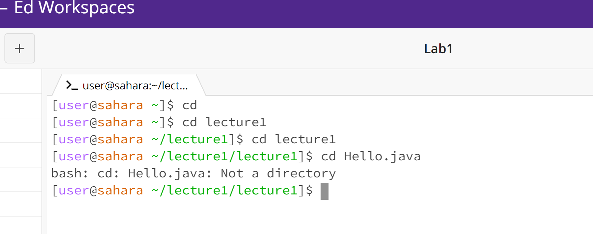

# CSE15L
## Lab 1

### cd-Test


+ ```
  [user@sahara ~]$ cd
  [user@sahara ~]$
  ```
The working directory is `/home`.
Output means from home directory change to home directory. 
The output is not error, No argument means the user is returned to the home directory.
  
+ ```
  [user@sahara ~]$ cd lecture1
  [user@sahara ~/lecture1]$
  ```
The working directory is `/home`
The output means working directory changed from `/home` to `/home/lecture1`. cd command with directory as argument meant to move working directory to the new directory whose name is the same as argument.
And output is not error, becasue it cd command meant to change directroy to the new directory named by argument.

+ ```
  [user@sahara ~/lecture1]$ cd Hello.java
  bash: cd: Hello.java: Not a directory
  [user@sahara ~/lecture1]$ 
  ```
The working directory is `/home/lecture1`
The cd command expects a valid directory as an argument or no argument, but Hello.java is a file, therefore error warning comes out.
The output is an error, as mentioned above, it outputs a `bash:` error says Hello.java is not a valid directory. cd command expect no argument or a directory name that exist in the current working directory as argument.

### ls-Test


+ ```
  [user@sahara ~]$ ls
  lecture1
  [user@sahara ~]$   
  ```
The working directory is `/home`.
The output means there is directory lecture1 in the current directory working diretory `/home`.
The ls without argument list all directories and files in the current working directory.
The output is not error, the command ls expects to have no argument or a directory as an argument that exist in the current working directory.


+ ```
  [user@sahara ~]$ ls lecture1
  Hello.class  Hello.java  lecture1  messages  README
  [user@sahara ~]$
  ```
The working directory is `/home`.
The output listed every directory and file in the directory `/home/lecture1`
The output is not error, the command ls expects to have no argument or a directory as an argument that exist in the current working directory.

+ ```
  [user@sahara ~]$ ls Hello.java
  ls: cannot access 'Hello.java': No such file or directory
  [user@sahara ~]$
  [user@sahara ~]$ cd lecture1
  [user@sahara ~/lecture1]$
  ```
(Above code is not a test. it is a mistake I made during my lab. )
The file hello.java is not in the working directory when enter the "ls Hello.java" command, so it gave me an error.
And then I moved to the new directory `/home/lecture1`.

+ ```
  [user@sahara ~/lecture1]$ ls Hello.java
  Hello.java
  [user@sahara ~/lecture1]$
  ```
The working directory  `/home/lecture1`
The output is file name that I entered, this means the file is in the current directory.
The output is not an error, the reason is command ls is disigned to have no argument and to have an argument with a directory or a file. 
Question: So, is the reason why this feature of ls is made to check if a certain file is in the current directory? 
Yes, if the pathname is a file, ls displays information about the file according to the requested options.

### cat-Test


+ ```
  [user@sahara ~]$ cat
  lecture1
  lecture1
  lecture1
  lecture1
  ^Z
  [2]+  Stopped                 cat
  [user@sahara ~]$ 
  ```
The working directory is  `/home`
Initially, there was no output. After I entered the first "lecture1" it outputs just what I entered which is "lecture1". Until I pressed the "ctrl + z" it stopped.
The command with no argument means the cat command will read data from its standard input and write them to its standard ouput. Stanard input refers to default input decvice that the program uses to read data.
The output is not an error, becasue cat is designed to have no argument, but it is useless.

+ ```
  [user@sahara ~]$ cat lecture1
  cat: lecture1: Is a directory
  [user@sahara ~]$
  ```
The working directory is  `/home`
The output shows an error, means a directory cannot be the argument of the cat command, And the command cat can have no argument or a file as argument.
The output is an error, because the command cat is designed to have file as an argument or with no argument, with directroy as an argument, it will output an error.

+ ```
  [user@sahara ~]$ cd lecture1
  [user@sahara ~/lecture1]$ cat Hello.java
  import java.io.IOException;
  import java.nio.charset.StandardCharsets;
  import java.nio.file.Files;
  import java.nio.file.Path;

  public class Hello {
    public static void main(String[] args) throws IOException {
      String content = Files.readString(Path.of(args[0]), StandardCharsets.UTF_8);    
      System.out.println(content);
  }
  }[user@sahara ~/lecture1]$
  ```
The working directory is `/home/lecture1`
The cat command outputs the contents in the file.
The output is not an error, the command executed successfully. because the command meant to have file as argument or with no argument.
